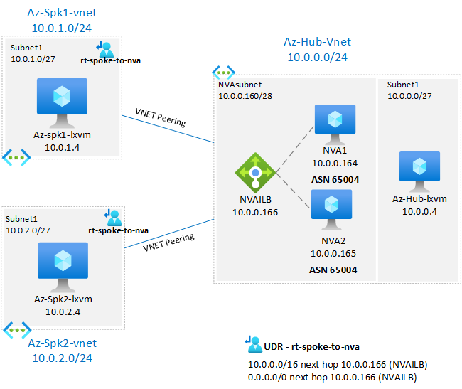
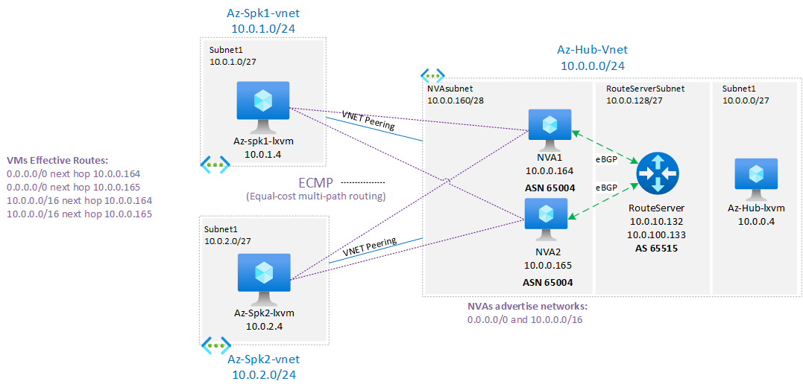
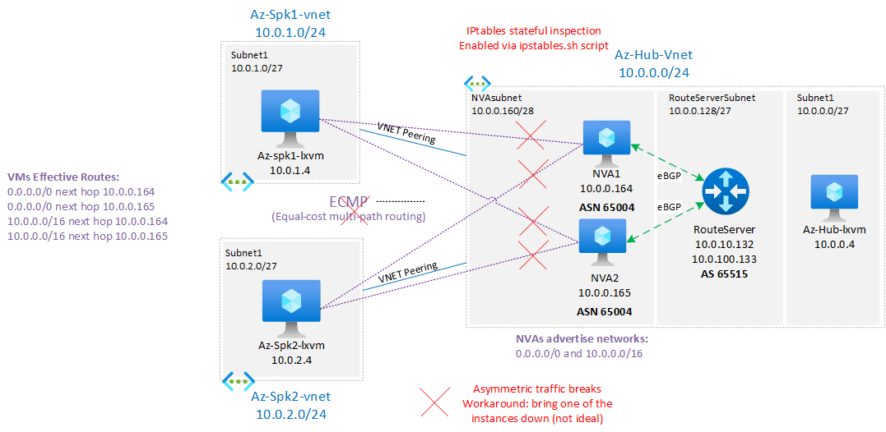

# Azure Route Server Next Hop IP lab

Content
- [Intro](#intro)

## Intro

The main objective of this lab is to demonstrate the benefit of the [Azure Route Server next hop IP feature](https://). However, to get there, we need to go over the following important points:

- Review and validate connectivity fundamentals between Spokes via Hub using UDRs.
- How to use Azure Route Server and NVAs to allow Spoke-to-Spoke connectivity without UDRs.
- Describe the default behavior for traffic going over high-available NVAs when using Azure Route Server.
- Introduce stateful inspection via Iptables on the NVAs and demonstrate the side effects of asymmetric routing for spoke-to-spoke connectivity (East/West traffic).
- Demonstrate the Azure Route Server Next Hop IP feature and how it solves potential asymmetric issues, and spoke-to-spoke go over NVAs leveraging stateful inspection.
- Configure and understand Internet Breakout and how to configure UDRs and NSGs to ensure NVAs can go out to the Internet.

## Base network topology


## Lab components

- There are three Virtual Networks (VNETs) where we have a Hub (10.0.0.0/24), Spoke1 (10.0.1.0/24) and Spoke2 (10.0.2.0/24).
- Hub VNET has three virtual machines (VMs): az-hub-lxvm (10.0.0.4), az-spk1-lxvm (10.0.1.4), and az-spk2-lxvm.
- Azure Route Server (az-hub-routeserver) for routing propagation between Linux NVAs and VNETs.
- Azure Load Banacer (az-hub-nvailb) 

## Task 1: Deploy base lab and test connectivity

### Deploy base lab

Use the following script to deploy the base lab. You can open [Azure Cloud Shell (Bash)](https://shell.azure.com) and run the following commands build to the entire lab:

```bash
wget -O 1deploy.sh https://raw.githubusercontent.com/dmauser/azure-routeserver/main/ars-nhip/1deploy.azcli
chmod +xr 1deploy.sh
./1deploy.sh
```

An alternative for Azure Cloud Shell is to install AZCLI for your Linux distribution or get Linux for Windows via WSL2. See more information in [Set up a WSL development environment](https://docs.microsoft.com/en-us/windows/wsl/setup/environment)

**Note:** Before running the script, you can change the parameters based on your requirements. Otherwise, what you see defined below is going to be the default settings used:

```Bash
#Parameters
rg=lab-ars-nhip #Define your resource group
location=eastus2 #Set location
username=azureuser #Set username
password=Msft123Msft123 #Set password
virtualMachineSize=Standard_DS1_v2 #Set VM size
```

### Validate transit between Spoke1 and Spoke2 VMs and setup UDRs

This step aims to validate the connectivity between both VMs in Spoke1 and Spoke2 VNETs.
It will demonstrate the connectivity using UDR via Load Balancer with both NVAs in the Hub.

Reference diagram:


```Bash
#Parameters
rg=lab-ars-nhip #Define your resource group
#Define parameters for Azure Hub and Spokes:
AzurehubName=az-hub #Azure Hub Name
Azurespoke1Name=az-spk1 #Azure Spoke 1 name
Azurespoke2Name=az-spk2 #Azure Spoke 1 name
location=$(az group show -n $rg --query location -o tsv)

# Check Spoke VMs route tables
echo Check Spoke VMs Route tables:
echo $Azurespoke1Name-lxvm &&\
az network nic show --resource-group $rg -n $Azurespoke1Name-lxvm-nic --query "ipConfigurations[].privateIpAddress" -o tsv &&\
az network nic show-effective-route-table --resource-group $rg -n $Azurespoke1Name-lxvm-nic -o table &&\
echo $Azurespoke2Name-lxvm &&\
az network nic show --resource-group $rg -n $Azurespoke2Name-lxvm-nic --query "ipConfigurations[].privateIpAddress" -o tsv &&\
az network nic show-effective-route-table --resource-group $rg -n $Azurespoke2Name-lxvm-nic -o table

# Can az-spk1-lxvm1 reach az-spk2-lxvm2?
# Use Bastion or Serial console to access az-SPK1-lxvm:
# Run the following commands:
ping 10.0.2.4 -c 5
sudo hping3 10.0.2.4 -S -p 80 -c 10
curl 10.0.2.4

# Access Bastion or Serial console on az-SPK2-lxvm:
# Run the following commands:
ping 10.0.1.4 -c 5
sudo hping3 10.0.1.4 -S -p 80 -c 10
curl 10.0.1.4

# How about connectivity to Hub-lxvm1 vm? Does it work?
ping 10.0.0.4 -c 5
sudo hping3 10.0.0.4 -S -p 80 -c 10
curl 10.0.0.4

# add UDR to NVA1 and re-validate connectivity

#UDR for Hub traffic to Azure NVA (disables BGP propagation)
## Create UDR + Disable BGP Propagation
nvalb=$(az network lb show -g $rg --name $AzurehubName-lxnva-ilb --query "frontendIpConfigurations[].privateIpAddress" -o tsv)
## Create UDR
az network route-table create --name rt-spoke-to-nva --resource-group $rg --location $location --disable-bgp-route-propagation true --output none
## Default and private traffic to the NVA Load Balancer:
az network route-table route create --resource-group $rg --name default-to-NVA --route-table-name rt-spoke-to-nva  \
--address-prefix 0.0.0.0/0 \
--next-hop-type VirtualAppliance \
--next-hop-ip-address $nvalb \
--output none
az network route-table route create --resource-group $rg --name private-traffic-to-NVA --route-table-name rt-spoke-to-nva  \
--address-prefix 10.0.0.0/16 \
--next-hop-type VirtualAppliance \
--next-hop-ip-address $nvalb \
--output none
# Associate to the Spoke 1 and 2 VM subnets
az network vnet subnet update -n subnet1 -g $rg --vnet-name $Azurespoke1Name-vnet --route-table rt-spoke-to-nva --output none
az network vnet subnet update -n subnet1 -g $rg --vnet-name $Azurespoke2Name-vnet --route-table rt-spoke-to-nva --output none

# Check Spoke VMs route tables (it may take few sconds to take effect the UDR changes made, re-run commands below until see expected route tables)
echo Check Spoke VMs Route tables:
echo $Azurespoke1Name-lxvm &&\
az network nic show --resource-group $rg -n $Azurespoke1Name-lxvm-nic --query "ipConfigurations[].privateIpAddress" -o tsv &&\
az network nic show-effective-route-table --resource-group $rg -n $Azurespoke1Name-lxvm-nic -o table &&\
echo $Azurespoke2Name-lxvm &&\
az network nic show --resource-group $rg -n $Azurespoke2Name-lxvm-nic --query "ipConfigurations[].privateIpAddress" -o tsv &&\
az network nic show-effective-route-table --resource-group $rg -n $Azurespoke2Name-lxvm-nic -o table

# Expected output:
:'
az-spk1-lxvm
10.0.1.4
Source    State    Address Prefix    Next Hop Type     Next Hop IP
--------  -------  ----------------  ----------------  -------------
Default   Active   10.0.1.0/24       VnetLocal
Default   Active   10.0.0.0/24       VNetPeering
Default   Invalid  0.0.0.0/0         Internet
User      Active   0.0.0.0/0         VirtualAppliance  10.0.0.166
User      Active   10.0.0.0/16       VirtualAppliance  10.0.0.166
az-spk2-lxvm
10.0.2.4
Source    State    Address Prefix    Next Hop Type     Next Hop IP
--------  -------  ----------------  ----------------  -------------
Default   Active   10.0.2.0/24       VnetLocal
Default   Active   10.0.0.0/24       VNetPeering
Default   Invalid  0.0.0.0/0         Internet
User      Active   0.0.0.0/0         VirtualAppliance  10.0.0.166
User      Active   10.0.0.0/16       VirtualAppliance  10.0.0.166
'
# Use Bastion or Serial console to access az-SPK1-lxvm:
# Run the following commands:
ping 10.0.2.4 -c 5 -O
sudo hping3 10.0.2.4 -S -p 80 -c 10
curl 10.0.2.4

# Access Bastion or Serial console on az-SPK2-lxvm:
# Run the following commands:
ping 10.0.1.4 -c 5
sudo hping3 10.0.1.4 -S -p 80 -c 10
curl 10.0.1.4

# *** IMPORTANT *** Disassociate the UDRs from the Spoke 1 and 2 VM subnets before moving to the next step.
az network vnet subnet update -n subnet1 -g $rg --vnet-name $Azurespoke1Name-vnet --route-table "" --output none
az network vnet subnet update -n subnet1 -g $rg --vnet-name $Azurespoke2Name-vnet --route-table "" --output none
```

## Task 2: Enable Azure Route Server BGP peering with NVAs

### Adding Azure Route Server

In the steps below, the script will build BGP peerings between both NVAs (az-hub-lxnva1 and az-hub-lxnva1) with Azure Route Server instances. UDRs have been removed from the previous step, and the goal is to show Spoke1 and Spoke2 transit via NVAs in the Hub VNET.

```Bash
#Parameters
rg=lab-ars-nhip #Define your resource group
location=$(az group show -n $rg --query location -o tsv)

# NVA specific parameters
nvasubnetname=nvasubnet
nvasubnetprefix="10.0.0.160/28"
nvaname=nva
instances=2 #NVA instances
#Specific NVA BGP settings
asn_quagga=65004 # Set ASN
# Set Networks to be propagated
bgp_network1=0.0.0.0/0 #Default Route Propagation
bgp_network2=10.0.0.0/16 #Summary route for Hub/Spoke transit

#Define parameters for Azure Hub and Spokes:
AzurehubName=az-hub #Azure Hub Name
Azurespoke1Name=az-spk1 #Azure Spoke 1 name
Azurespoke2Name=az-spk2 #Azure Spoke 1 name

# Peer with Route Server
echo Peering NVAs with Route Server
nvanames=$(az vm list -g $rg --query '[?contains(name,`'$nvaname'`)].name' -o tsv)
for nvaintname in $nvanames
do
 #NVA BGP config variables (do not change)
 bgp_routerId=$(az network nic show --name "$nvaintname"VMNic --resource-group $rg --query ipConfigurations[0].privateIpAddress -o tsv)
 routeserver_IP1=$(az network routeserver list --resource-group $rg --query '{IPs:[0].virtualRouterIps[0]}' -o tsv)
 routeserver_IP2=$(az network routeserver list --resource-group $rg --query '{IPs:[0].virtualRouterIps[1]}' -o tsv)

 # Enabling routing, NAT and BGP on Linux NVA:
 echo Enabling routing, NAT and BGP on Linux NVA $nvaintname
 scripturi="https://raw.githubusercontent.com/dmauser/azure-routeserver/main/ars-nhip/script/linuxrouterbgp.sh"
 az vm extension set --resource-group $rg --vm-name $nvaintname --name customScript --publisher Microsoft.Azure.Extensions \
 --protected-settings "{\"fileUris\": [\"$scripturi\"],\"commandToExecute\": \"./linuxrouterbgp.sh $asn_quagga $bgp_routerId $bgp_network1 $bgp_network2 $routeserver_IP1 $routeserver_IP2 $nexthopip\"}" \
 --force-update \
 --no-wait 

 # Building Route Server BGP Peering
 echo Building BGP Peering between $AzurehubName-routeserver and $nvaintname
 az network routeserver peering create --resource-group $rg --routeserver $AzurehubName-routeserver --name $nvaintname --peer-asn $asn_quagga \
 --peer-ip $(az network nic show --name "$nvaintname"VMNic --resource-group $rg --query ipConfigurations[0].privateIpAddress -o tsv) \
 --output none
done
```

### Validate connectivity between Spoke1 and Spoke2 VMs

Let's validate the connectivity between Spoke1 and Spoke2 VMs by only using Azure Route Server after NVAs got configured to advertise networks 10.0.0.0/16 and 0.0.0.0/0 (the default route is for Internet Breakout, and more details on that at Task 5).

Reference diagram:



```Bash
#Parameters
rg=lab-ars-nhip #Define your resource group
#Define parameters for Azure Hub and Spokes:
AzurehubName=az-hub #Azure Hub Name
Azurespoke1Name=az-spk1 #Azure Spoke 1 name
Azurespoke2Name=az-spk2 #Azure Spoke 1 name

# Validations after enabling Route Server peering 
echo Check Spoke VMs Route tables:
echo $Azurespoke1Name-lxvm &&\
az network nic show --resource-group $rg -n $Azurespoke1Name-lxvm-nic --query "ipConfigurations[].privateIpAddress" -o tsv &&\
az network nic show-effective-route-table --resource-group $rg -n $Azurespoke1Name-lxvm-nic -o table &&\
echo $Azurespoke2Name-lxvm &&\
az network nic show --resource-group $rg -n $Azurespoke2Name-lxvm-nic --query "ipConfigurations[].privateIpAddress" -o tsv &&\
az network nic show-effective-route-table --resource-group $rg -n $Azurespoke2Name-lxvm-nic -o table

# Can az-spk1-lxvm reach az-spk2-lxvm?
# Access Bastion or Serial console on az-spk1-lxvm:
# Run the following
ping 10.0.2.4 -c 5
sudo hping3 10.0.2.4 -S -p 80 -c 10
curl 10.0.2.4
# Check also from the opposite side. From az-spk2-lxvm to az-spk1-lxvm.
ping 10.0.1.4 -c 5
sudo hping3 10.0.1.4 -S -p 80 -c 10
curl 10.0.1.4

# Run TCP traceroute to check BGP ECMP first hop NVA1 and NVA2 may change.
# Run command below multiple times to see IP change on the first hop (NVAs).
# from az-spk1-lxvm
tcptraceroute 10.0.2.4 80
# from az-spk2-lxvm
tcptraceroute 10.0.1.4 80

# Review Route Server configuration:

#Route Server config
# RS instance IPs
rsname=$(az network routeserver list --resource-group $rg --query [].name -o tsv)
echo Route Server IPs: && \
az network routeserver list --resource-group $rg --query '[].virtualRouterIps[]' -o tsv && \
echo -e && \
# RS BGP peerings
echo Route Server BGP peerings: && \
az network routeserver peering list --resource-group $rg --routeserver $rsname -o table && \
echo -e && \
# RS advertised routes to NVA1 and NVA2
for nva in $(az vm list -g $rg --query '[?contains(name,`'$nvaname'`)].name' -o tsv)
do
  echo Advertised routes from RS $rsname to $nva
  az network routeserver peering list-advertised-routes \
   --resource-group $rg \
   --name $nva \
   --routeserver $rsname \
   --query "[RouteServiceRole_IN_0,RouteServiceRole_IN_1][]" \
   --output table
  echo -e
done && \
# RS learned routes
for nva in $(az vm list -g $rg --query '[?contains(name,`'$nvaname'`)].name' -o tsv)
do
  echo Learned routes on RS $rsname from $nva
  az network routeserver peering list-learned-routes \
   --resource-group $rg \
   --name $nva \
   --routeserver $rsname \
   --query "[RouteServiceRole_IN_0,RouteServiceRole_IN_1][]" \
   --output table
  echo -e
done

# Optional - review NVA BGP configuration
# 1) Access either NVAs or both and run the following commands:
# 2) Elevate shell as root by running
sudo -s
# Review BGP config by running both commands:
vtysh 
show running-config
show ip bgp
show ip bgp summary
show ip bgp neighbors
show ip bgp neighbors 10.0.0.132 received-routes
show ip bgp neighbors 10.0.0.132 advertised-routes
show ip bgp neighbors 10.0.0.133 received-routes
show ip bgp neighbors 10.0.0.133 advertised-routes
```

## Task 3: enabling traffic inspection on the NVAs

In this section, both NVAs and how that will affect transit between Spoke 1 and Spoke 2 VMs.

### Enabling Iptables

```Bash
#Parameters
rg=lab-ars-nhip #Define your resource group

#Enable Iptables on both NVAs by allowing ICMP and TCP ports 80, 53, 443, 22, and 5201
echo 'Enable Iptables NVA by allowing ICMP, TCP ports 80, 53, 443, 22, and 5201'
nvanames=$(az vm list -g $rg --query '[?contains(name,`'$nvaname'`)].name' -o tsv)
for nvaintname in $nvanames
do
 # Enable routing, NAT and BGP on Linux NVA:
 echo Enabling Iptables rules on $nvaintname
 scripturi="https://raw.githubusercontent.com/dmauser/azure-routeserver/main/ars-nhip/script/Iptables.sh"
 az vm extension set --resource-group $rg --vm-name $nvaintname --name customScript --publisher Microsoft.Azure.Extensions \
 --protected-settings "{\"fileUris\": [\"$scripturi\"],\"commandToExecute\": \"./Iptables.sh\"}" \
 --force-update \
 --output none
done
```

### Validate connectivity after Iptables enabled

There are some unexpected behaviors after enabling Iptables. The diagram below illustrates some of them:



Please, follow the procedure below and answer some questions.

```Bash
# Review the Iptables rules enforced by using the following link:
https://raw.githubusercontent.com/dmauser/azure-routeserver/main/ars-nhip/script/Iptables.sh

# Can az-spk1-lxvm reach az-spk2-lxvm?
# Access Bastion or Serial console on az-spk1-lxvm:
# Run the following commands
ping 10.0.2.4 -c 5
sudo hping3 10.0.2.4 -S -p 80 -c 10
curl 10.0.2.4
# Check also from the opposite side. From az-spk2-lxvm to az-spk1-lxvm.
ping 10.0.1.4 -c 5
sudo hping3 10.0.1.4 -S -p 80 -c 10
curl 10.0.1.4

# Questions:
# 1) Why do you see packet loss when you run hping3?
# 2) Why does ping dont fail?
# 3) Your curl command can work or fail if you re-run multiple times, why?

# (OPTIONAL) Review Iptables and start network captures running on both NVA1 and NVA2
sudo Iptables -L -v #review Forward IP table rules
sudo tcpdump -n host 10.0.1.4 and host 10.0.2.4

# ====> Turn off one of the NVAs above and re-run the same tests:
# Check the route table after one of the NVAs are offline
echo Check Spoke VMs Route tables:
echo $Azurespoke1Name-lxvm &&\
az network nic show --resource-group $rg -n $Azurespoke1Name-lxvm-nic --query "ipConfigurations[].privateIpAddress" -o tsv &&\
az network nic show-effective-route-table --resource-group $rg -n $Azurespoke1Name-lxvm-nic -o table
echo $Azurespoke2Name-lxvm &&\
az network nic show --resource-group $rg -n $Azurespoke2Name-lxvm-nic --query "ipConfigurations[].privateIpAddress" -o tsv &&\
az network nic show-effective-route-table --resource-group $rg -n $Azurespoke2Name-lxvm-nic -o table

# Can az-spk1-lxvm1 reach az-spk2-lxvm2?
# Access Bastion or Serial console on az-SPK1-lxvm:
# Run the following commands on SPK2-lxvm1
sudo hping3 10.0.2.4 -S -p 80 -c 10
curl 10.0.2.4

# Access Bastion or Serial console on az-SPK2-lxvm:
# Run the following commands
sudo hping3 10.0.1.4 -S -p 80 -c 10
curl 10.0.1.4

# Questions:
# 1) Why does the connectivity with hping3 and curl work after you bring one of the NVA instances down?
# 2) If you bring the other NVA back online again, what happens?

# Important ===========> Bring back the NVA and make sure both are up and running before you proceed to task 4.
```

## Task 4: Enabling the custom IP Next Hop feature

We will leverage the BGP attribute called custom next hop IP to use Azure Load Balancer as the next. Both NVAs have a route-map configured with the command [set ip next-hop](https://www.nongnu.org/quagga/docs/docs-multi/Route-Map-Set-Command.html), and when interacting via BGP with Azure Route Server, that passes that information to the Virtual Network, finally committing to the effective routes of the Spoke 1 and 2 VMS.

### Configuring route-map _set ip next-hop_ on both NVAs

```Bash
# ====> Note ***: Before running next session make sure both NVAs are up and running
#Parameters
rg=lab-ars-nhip #Define your resource group
#Define parameters for Azure Hub and Spokes:
AzurehubName=az-hub #Azure Hub Name
Azurespoke1Name=az-spk1 #Azure Spoke 1 name
Azurespoke2Name=az-spk2 #Azure Spoke 1 name

# NVA specific parameters
nvasubnetname=nvasubnet
nvasubnetprefix="10.0.0.160/28"
nvaname=lxnva
instances=2 #NVA instances
#Specific NVA BGP settings
asn_quagga=65004 # Set ASN
# Set Networks to be propagated
bgp_network1=0.0.0.0/0 #Default Route Propagation
bgp_network2=10.0.0.0/16 #Summary route for Hub/Spoke transit

# *** Note ***: Before running next session make sure both NVAs are up and running
echo Configuring NVAs to use custom IP Next hop to Load Balancer
# Set Next-Hop IP
nexthopip=$(az network lb show -g $rg --name $AzurehubName-$nvaname-ilb --query "frontendIpConfigurations[0].privateIpAddress" -o tsv) 
bgp_routerId=$(az network nic show --name "$nvaintname"VMNic --resource-group $rg --query ipConfigurations[0].privateIpAddress -o tsv)
routeserver_IP1=$(az network routeserver list --resource-group $rg --query '{IPs:[0].virtualRouterIps[0]}' -o tsv)
routeserver_IP2=$(az network routeserver list --resource-group $rg --query '{IPs:[0].virtualRouterIps[1]}' -o tsv)
nvanames=$(az vm list -g $rg --query '[?contains(name,`'$nvaname'`)].name' -o tsv)
for nvaintname in $nvanames
do
 # Enable routing, NAT and BGP on Linux NVA:
 scripturi="https://raw.githubusercontent.com/dmauser/azure-routeserver/main/ars-nhip/script/linuxrouterbgpnh.sh"
 az vm extension set --resource-group $rg --vm-name $nvaintname --name customScript --publisher Microsoft.Azure.Extensions \
 --protected-settings "{\"fileUris\": [\"$scripturi\"],\"commandToExecute\": \"./linuxrouterbgpnh.sh $asn_quagga $bgp_routerId $bgp_network1 $bgp_network2 $routeserver_IP1 $routeserver_IP2 $nexthopip\"}" \
 --force-update 
done
```

### Connectivity revalidation after enabling _set ip next-hop_

```Bash
#Parameters
rg=lab-ars-nhip #Define your resource group
nvaname=lxnva
#Define parameters for Azure Hub and Spokes:
AzurehubName=az-hub #Azure Hub Name
Azurespoke1Name=az-spk1 #Azure Spoke 1 name
Azurespoke2Name=az-spk2 #Azure Spoke 1 name

# Check Spoke VMs route tables
echo Load Balancer IP: &&\
 az network lb show -g $rg --name $AzurehubName-$nvaname-ilb --query "frontendIpConfigurations[0].privateIpAddress" -o tsv &&\
echo Check Spoke VMs Route tables: &&\
echo $Azurespoke1Name-lxvm &&\
 az network nic show --resource-group $rg -n $Azurespoke1Name-lxvm-nic --query "ipConfigurations[].privateIpAddress" -o tsv &&\
 az network nic show-effective-route-table --resource-group $rg -n $Azurespoke1Name-lxvm-nic -o table  &&\
echo $Azurespoke2Name-lxvm &&\
 az network nic show --resource-group $rg -n $Azurespoke2Name-lxvm-nic --query "ipConfigurations[].privateIpAddress" -o tsv &&\
 az network nic show-effective-route-table --resource-group $rg -n $Azurespoke2Name-lxvm-nic -o table

# Can az-spk1-lxvm1 reach az-spk2-lxvm2?
# Access Bastion or Serial console on az-SPK1-lxvm:
# Run the following to SPK2-lxvm1
sudo hping3 10.0.2.4 -S -p 80 -c 10
curl 10.0.2.4 

# Access Bastion or Serial console on az-SPK2-lxvm:
# Run the following
sudo hping3 10.0.1.4 -S -p 80 -c 10
curl 10.0.1.4

#Run tcptraceroute to check NVA instances intercepting the traffic via Load Balancer.
# Run command below multiple times to see IP change on the first hop (NVAs).
# from az-spk1-lxvm
tcptraceroute 10.0.2.4 80

# from az-spk2-lxvm
tcptraceroute 10.0.1.4 80

#Route Server specific settings:

# RS instance IPs
rsname=$(az network routeserver list --resource-group $rg --query [].name -o tsv)
echo Route Server IPs: && \
az network routeserver list --resource-group $rg --query '[].virtualRouterIps[]' -o tsv && \
echo -e && \
# RS BGP peerings
echo Route Server BGP peerings: && \
az network routeserver peering list --resource-group $rg --routeserver $rsname -o table && \
echo -e && \
# RS advertised routes to NVA1 and NVA2
for nva in $(az vm list -g $rg --query '[?contains(name,`'$nvaname'`)].name' -o tsv)
do
  echo Advertised routes from RS $rsname to $nva
  az network routeserver peering list-advertised-routes \
   --resource-group $rg \
   --name $nva \
   --routeserver $rsname \
   --query "[RouteServiceRole_IN_0,RouteServiceRole_IN_1][]" \
   --output table
  echo -e
done && \
# RS learned routes
for nva in $(az vm list -g $rg --query '[?contains(name,`'$nvaname'`)].name' -o tsv)
do
  echo Learned routes on RS $rsname from $nva
  az network routeserver peering list-learned-routes \
   --resource-group $rg \
   --name $nva \
   --routeserver $rsname \
   --query "[RouteServiceRole_IN_0,RouteServiceRole_IN_1][]" \
   --output table
  echo -e
done

# Optional - review NVA BGP configuration
# 1) Access either NVAs or both and run the following commands:
# 2) Elevate shell as root by running
sudo -s
# Review BGP config by running both commands:
vtysh 
show running-config
show ip bgp
show ip bgp summary
show ip bgp neighbors
show ip bgp neighbors 10.0.0.132 received-routes
show ip bgp neighbors 10.0.0.132 advertised-routes
show ip bgp neighbors 10.0.0.133 received-routes
show ip bgp neighbors 10.0.0.133 advertised-routes
```
