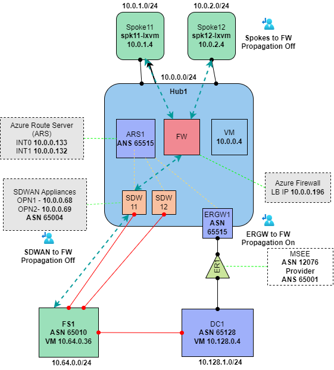

# Lab: SDWAN using Azure Route Server

### Lab notes

- Azure has a hub and two spokes
- On-premises is represented by a Datacenter (DC1) and Fild Site (aka remote branch)
- FS1 is the remote field site with SD-WAN device
- There a two options on this lab: OPNSense or Linux that can be used as SD-WAN devices.
    - Both of them use FRR BGP plugin.

### Diagram

